# Graduate Application Portal

## An agile exercise

Software Engineering Tools and Languages (CS:5820) at the University of Iowa emphasized on stepping into an established set of development practices as an engineer. This was accomplished by purposefully teaching Ruby, a language known for having a user-base who tended to strictly adhere to a strict programming style that attempted to emulate natural language speech patterns.\*

Ruby also affords the Ruby on Rails web-app framework - a framework which takes a convention over configuration approach to development. This forces a student in the course to quickly adopt all the conventions being used by the community as a whole and take them for granted. A luxury until a certain implementation goes awry.

The last third of the semester definitely presented many opportunities for things to go awry. The final month and a half started with the student body dividing itself into teams of 4-6 people. The instructor gave a presentation as a role of a client and gave description of a product that needed to be developed. The description was tight in places, and purposefully vague in others. It was up to each team's product owner to continue the communication with the client and clarify business rules and expectations.

The team I was a part of operated with respect to 1.5 week sprints - totaling three sprints over the course of the exercise. These sprints were tracked using Pivotal Tracker where we also collated a set of user stories based on the initial and subsequent meetings with the client. The application produced is located at a cloned repository - [graduate-app](https://github.com/alanmmckay/graduate-app).\*\* The app itself can be accessed using the [Dockerfile](https://github.com/alanmmckay/graduate-app/blob/main/Dockerfile), as described in the [README](https://github.com/alanmmckay/graduate-app/blob/main/README.md) file of the repository.

## Tour of features

The client wanted a portal for applicants to a graduate school. The feature list is too long to recount - this is due to the fact that this documentation is being written years after the project in tandem with the fact that Pivotal Tracker is now defunct. It should be said that the feature list was also unrealistic to wholly implement in the short amount of time from the start of the project to the conclusion of the semester. This necessitated the need to winnow the overall list to isolate important features for a minimum viable product.

### Entities as MVPs

The onset of the project had us prioritizing user stories to help define the MVP to present after the third sprint. The user stories we selected to implement emphasized two particular users of the system - one who was applying for graduate school (student) and one who reviews an application (faculty). Both of these entities are indeed extensions of a generic user, but the expected behaviors of these entities diverge in terms of how they interact with the entities that an applicant produces.

Insight to the relationships of these entities can be gleaned by looking in the application's [app/models/](https://github.com/alanmmckay/graduate-app/tree/main/source/app/models) folder. Specifically both [student.rb](https://github.com/alanmmckay/graduate-app/blob/main/source/app/models/student.rb) and [faculty.rb](https://github.com/alanmmckay/graduate-app/blob/main/source/app/models/faculty.rb). These relationships are also defined in `db/schema.rb` after running `rake db:migrate`. A partial definition of `schema.rb` includes the following:

```335
create_table "students", force: :cascade do |t|
    t.integer "user_id"
    t.text    "gender"
    t.text    "citizenship"
    t.text    "address"
end

create_table "faculties", force: :cascade do |t|
    t.integer "user_id"
    t.string  "university"
end
```

The `user_id` integer within both of these entities established by the relationship defined within each respective model: `belongs_to :user`. The result of `rake db:migrate` with respect to [user.rb](https://github.com/alanmmckay/graduate-app/blob/main/source/app/models/user.rb) produces the following code block:

```280
create_table "users", force: :cascade do |t|
    t.datetime "created_at",      null: false
    t.datetime "updated_at",      null: false
    t.text     "email"
    t.text     "phone"
    t.text     "lname"
    t.text     "fname"
    t.string   "password_digest"
end
```

From this pattern, the following properties can be surmised:

- A user of the graduate application portal who is a student will provide an email, phone number, first name, last name, login password, gender, citizenship status, and address.
- A user of the graduate application portal who is a faculty member will provide an email, phone number, first name, last name, login password, and the university to which they belong.

A set of user stories were generated to address each of these data points. In the context of a faculty member, it was noted that some administrator or programmatic API will establish these data points. The MVP for this project did not prioritize this facet.

A user story also justified the `university` attribute for a faculty member. This was to highlight a potential spot for extensibility of this web-app, where a given portal may govern multiple universities, which was noted in an epic.

It's important to keep in mind the context that justification was made for each attribute noted for the models above. It's also important to note that justification was given to exclude any attributes the reader may deem missing. These were likely put onto a backlog.

Knowing this, the following relationships within the aforementioned model files imply an implemented feature for the MVP. The relationships are as follows:

- A `Student` model `has_many :grad_applications` 
- A `Student` model `has_many :degrees`
- A `Faculty` model `has_many :grad_applications` 
- A `Faculty` model `has_many :grad_app_reviews` 

The `schema.db` file produced by `rake db:migrate` defines these three new models as follows:

```860
create_table "grad_applications", force: :cascade do |t|
    t.string   "university"
    t.datetime "date"
    t.string   "research_area"
    t.string   "deg_obj"
    t.string   "deg_obj_major"
    t.integer  "student_id"
    t.text     "statement_of_purpose"
    t.integer  "faculty_id"
    t.string   "status"
end

create_table "grad_app_reviews", force: :cascade do |t|
    t.integer "grad_applications_id"
    t.integer "faculty_id"
    t.text    "comments"
    t.integer "score"
    t.integer "grad_application_id"
    t.integer "faculties_id"
end

create_table "degrees", force: :cascade do |t|
    t.integer "student_id"
    t.string  "name"
    t.string  "city"
    t.string  "address"
    t.string  "phone"
    t.string  "major"
    t.string  "degree_type"
    t.string  "gpa"
end
```

Looking into each of these models will expose a set of `belongs_to` relationships which emphasize the model composition at play. It's worth noting a final relationship for the `GradApplication` model - `has_many :letter_of_recommendations`. This leads to the following block within `schema.rb`:

```280
create_table "letter_of_recommendations", force: :cascade do |t|
    t.integer  "grad_application_id"
    t.string   "email"
    t.string   "url"
    t.string   "letter"
    t.boolean  "submitted"
    t.datetime "created_at",          null: false
    t.datetime "updated_at",          null: false
end
```

This last model gives insight to another user within our set of user stories - a recommender; someone who writes and submits a letter of recommendation for an applicant.

Scaffold commands and migrations were leveraged to set up these models and relationships. The logic was provided within their respective controllers to allow a particular user to perform the necessary CRUD operations for all these components to establish an MVP to present near upon the conclusion of the third sprint.

### Flow of user experience

#### Consistency of front-end implementation

One thing that set the team apart from others was the emphasis on user experience. The first step established here was ensuring usage of the [bootstrap framework](https://getbootstrap.com/). This helped produce a user interface that is both mobile responsive, familiar, and aesthetically pleasing. Further more, a set of helper functions were established to ensure consistency of the implementation of the front-end.

Each model has a set of validations in place to reject invalid data. A user should be informed if their http post is rejected. The set of helper functions abstracted this detail away from the relevant controller. These helper functions also consistently produced the relevant bootstrap markup for each form element.

This set of helper functions would eventually be published as a Ruby Gem - [form_input_field](https://rubygems.org/gems/form_input_field). The logic and reasoning behind the development of these helper functions is discussed on this website at [Ruby on Rails - Developing DRY Forms](https://alanmckay.blog/projects/form/).

#### Piecemeal http posting

In terms of producing a minimum viable product, it's tempting to create a single form where an applicant submits all the relevant data contained within the `Student`, `Degree`, `GradApplication`, and `LetterOfRecommendation` models. Indeed, many other teams chose to travel that path, where the time saved was spent on some other type of user within their user stories. This team instead chose to ask for this information in a piecemeal fashion, where each step can be halted and resumed at a later time. 

This provides a usability advantage. Consider a case where an applicant can start their application, fill out some information and then realize that they need to gather a list of people to write letters of recommendation through the portal. In this scenario, they may not have had the foresight that they will need to ask a set of individuals to provide a letter of recommendation. By implementing piecemeal http posting, they can logout and resume their application after they've gathered the required email addresses of their recommenders.

This process begins from the portal's landing page where a user is asked to either login or to register:

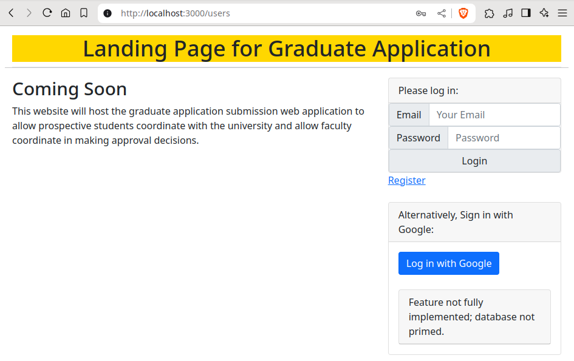

The above screenshot shows the bootstrap framework at play here. The `form_input_field` gem produces a set of input tags along with their associated label tags. Pressing register presents the following screen:

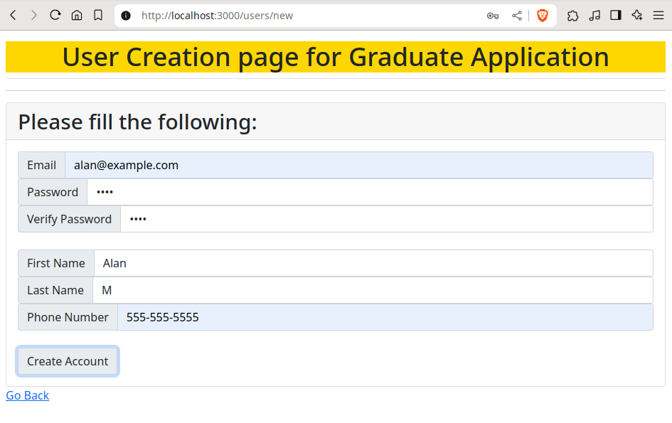

A successful registration will present the banner that is now located above the login form on the landing page. 

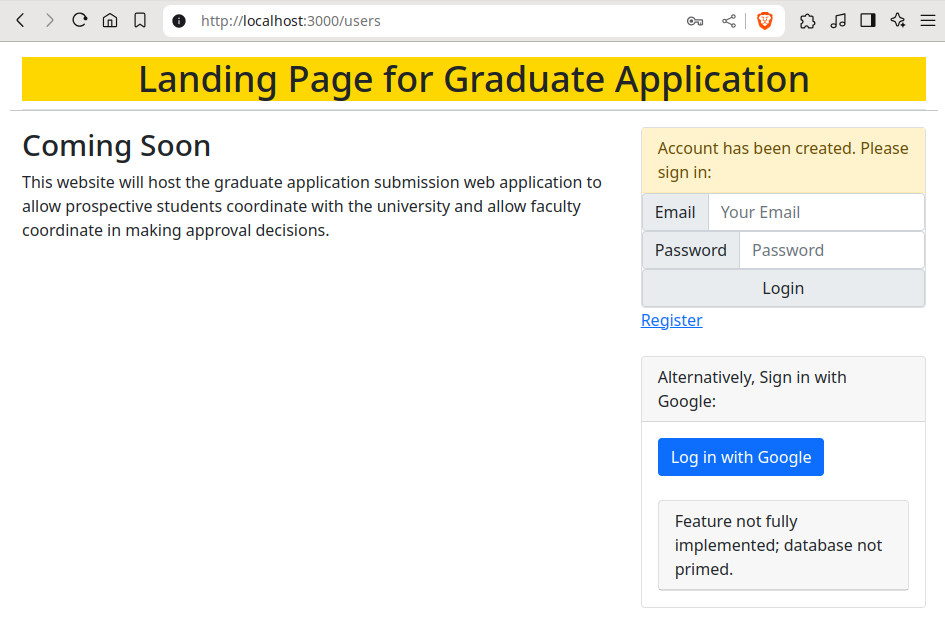

A user can use the credentials they previously submitted to log in - should the credentials have been valid! The following screenshot shows the registration page where invalid information is given. Each of the error stubs are also produced by the `form_input_field` gem.

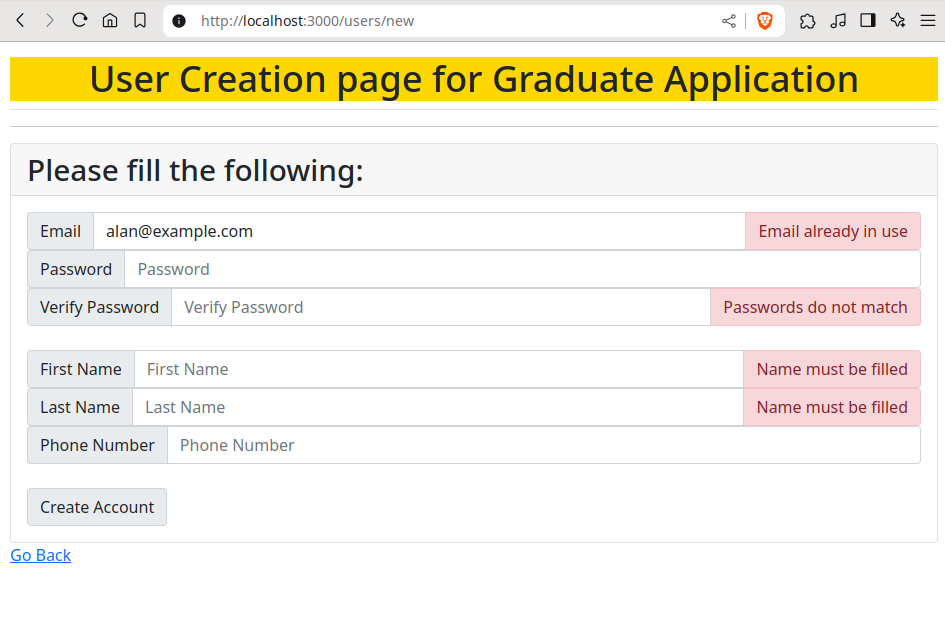

A successful login presents a user landing page. Anyone who registers through the website's registration portal, via the `user` controller's `new` method at the `users/new` route, is assumed to be a student. The user landing page displays a set of menu items that allows one to begin or continue their application. They can also edit any information they've previously given. This landing page also displays the information they've given thus far. 

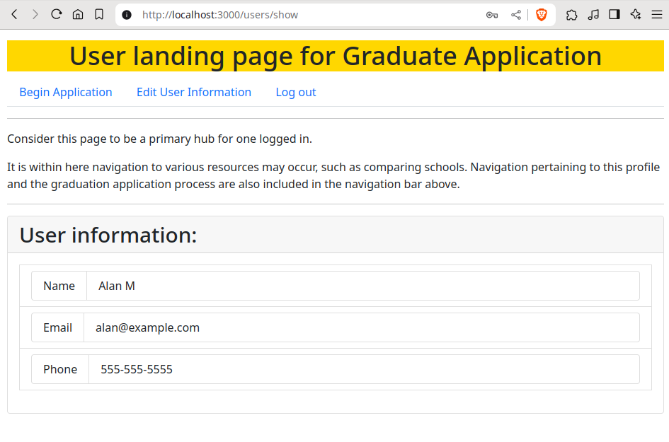

This panel will grow as they complete more of their application. When a user clicks the "Begin Application" menu item in the top bar, they are presented with a form that lets them input their citizenship status, their gender, and their address. Submission of this information will then present them with a screen which allows them to start inputting the degrees that they currently hold. At any point the user can instead click cancel instead of submitting the required information, which brings them back to their landing page:

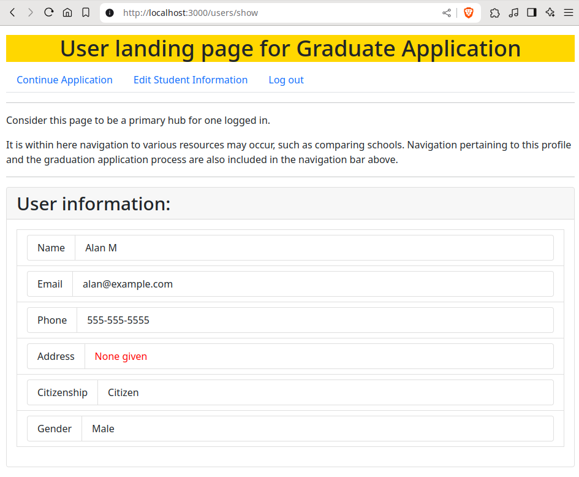

Notice the "Begin Application" menu item has now changed to "Continue Application". Clicking this menu item will take them back to the degree page.

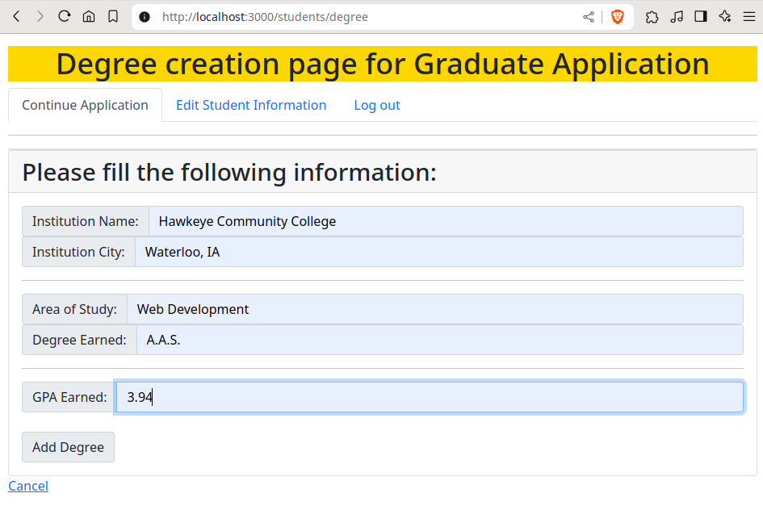

Once filling in information about their degree, a post will be made and they will be routed back to the same form! A banner will inform them that the degree was successfully added and they can choose to input another. 

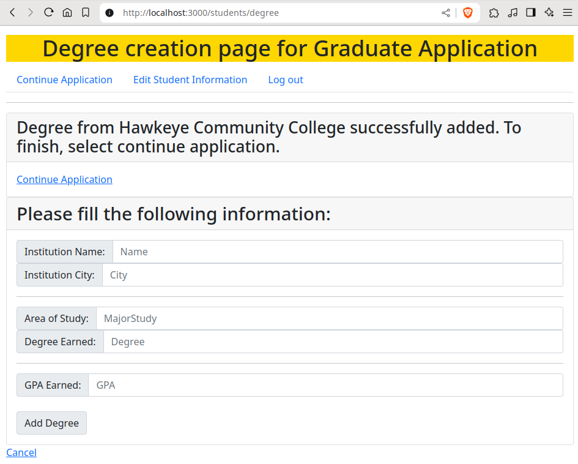

Once they are satisfied, they can instead continue the application or select cancel to go back to the user portal.

Consider the case where they choose to edit prior information by selecting "Edit Student Information" within the top menu bar. Before the input of a degree, this page would look as follows:

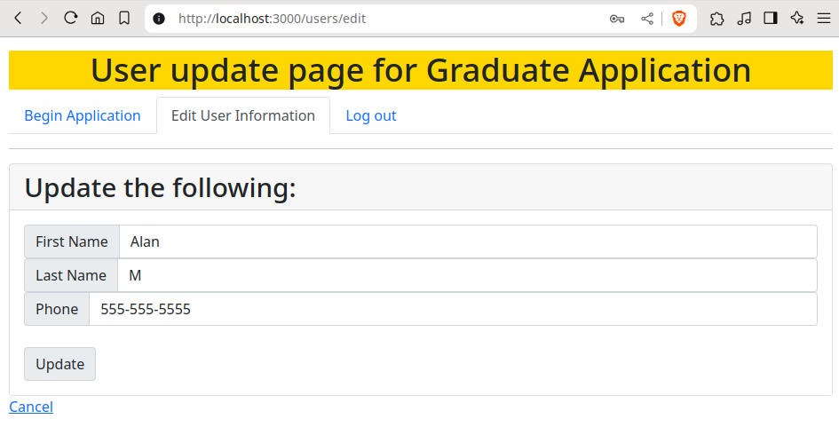

After adding the degree, the `students/edit` page now reflects this change:

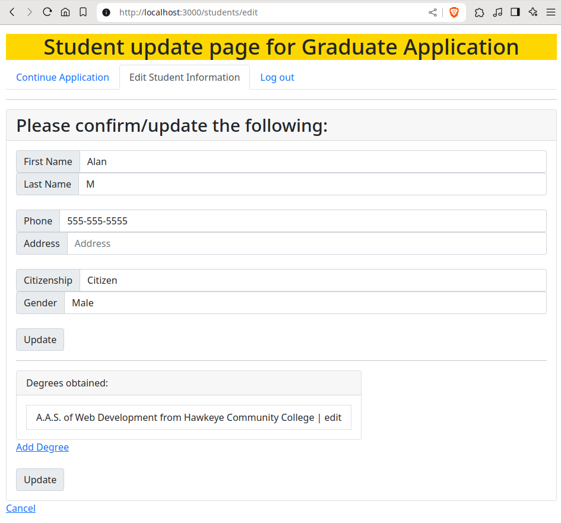

Continuing the application, the user is prompted to insert information pertinent to the university they are applying for - anything related to the `GradApplication` model. This includes giving a set of emails for individuals to write a letter of recommendation and this includes a space for the application to write a statement of purpose.

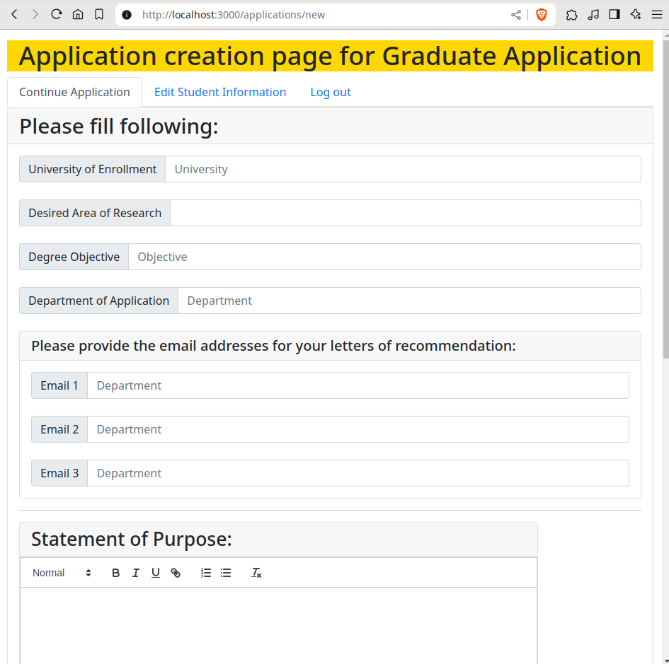

Take note the rich text editor for the Statement of Purpose panel. This is the [Quill](https://quilljs.com/) editor. The applicant is free to use any of the markup features given here and will be reflected from within any other view.

If one were to scroll further down the page, the applicant will have an opportunity to confirm the information they've entered prior before opting to finish the application.

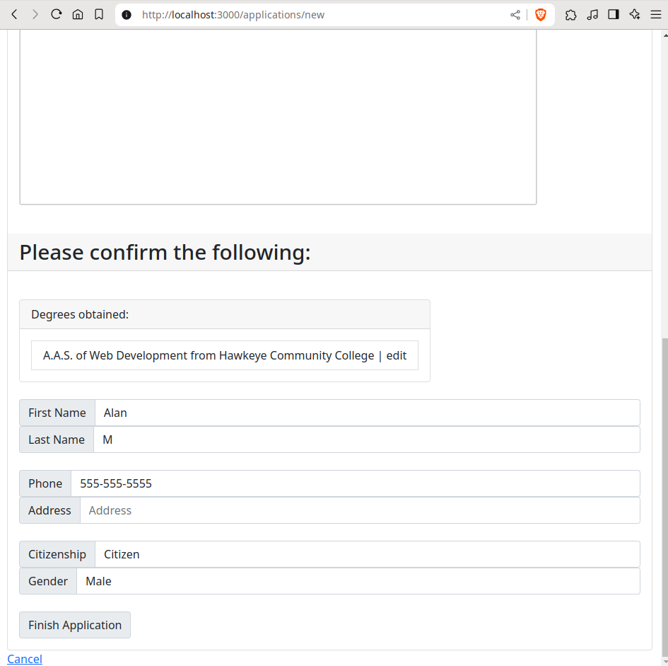

Once submitted, the controller will inform them of the submission and the applicant can view their application.

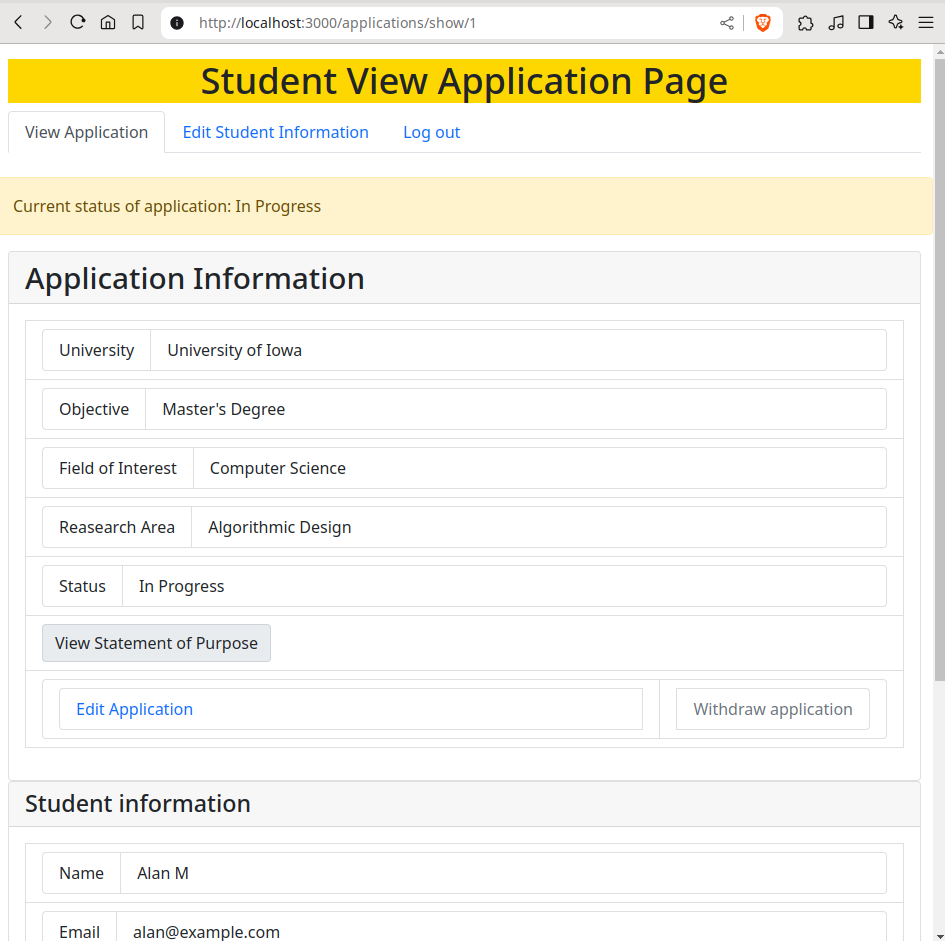

This flow of piecemeal http posting is reflected for all users of this application. Consider a faculty member who wishes to review applications. Their landing page is as follows:

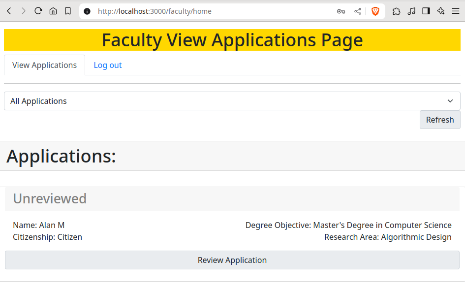

Here they can sort applications and select for review. The review page displays the relevant applicant information while allowing them to leave comments and rank the application.

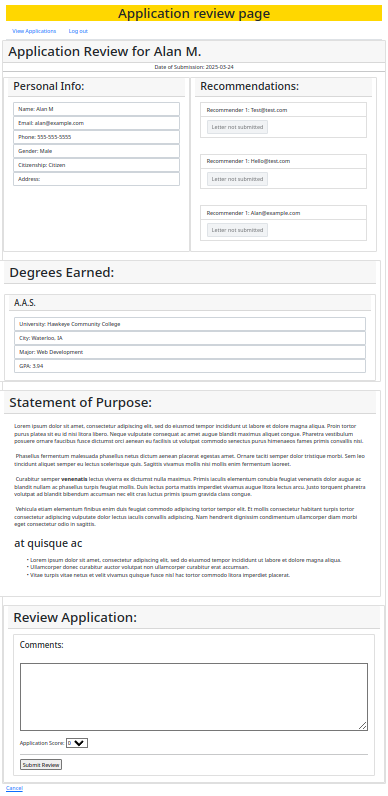

## Remaining features

What hasn't been shown thus far is the point of view of a user of this system who writes a letter of recommendation for an applicant. This user interface is in place at [/app/views/letter_of_recommendation](https://github.com/alanmmckay/graduate-app/tree/main/source/app/views/letter_of_recommendation) where its controller is at [app/controllers/letter_of_recommendation_controller.rb](https://github.com/alanmmckay/graduate-app/blob/main/source/app/controllers/letter_of_recommendation_controller.rb). Upon the submission of a graduate application, the `GradApplicationsController`'s `create` method contains the following block:

```350
letter_1 = LetterOfRecommendationController::create_letter(linfo[:recommender_1],current_user)
letter_2 = LetterOfRecommendationController::create_letter(linfo[:recommender_2],current_user)
letter_3 = LetterOfRecommendationController::create_letter(linfo[:recommender_3],current_user)
if application.valid?  and letter_1.valid? and letter_2.valid? and letter_3.valid? and user.valid? and user.student.valid? and degrees_valid and not has_script?(ginfo[:statement_of_purpose])
    application.letter_of_recommendations << letter_1
    application.letter_of_recommendations << letter_2
    application.letter_of_recommendations << letter_3

    ...
    
end
```

The code within the conditional ensures the correct object composition with respect to the relations described in the relevant models while the `LetterOfRecommendationController`'s `create_letter` method is enacted outside of the context of its set of routes.

The `create_letter` method contains the following:

```480
def self.create_letter(email, user)
    iterations = rand(1..10000)
    i = 0
    url = "#{user.email}#{@email}"
    while i < iterations
      url = Digest::SHA256.hexdigest url
      i = i + 1
    end
    letter_of_recommendation = LetterOfRecommendation.new(:email => email, :url => url)

    if letter_of_recommendation.valid?
      #Letter.email_recommender(user: user, url: url,email: email).deliver_now
    end

    letter_of_recommendation #this could have error messages associated; will need to check at higher scope
end
```

Here, a url for a recommendation writer is dynamically generated using their email as a seed in a similar vein to how passwords are hashed and salted. After this is created, the line which contains an `email_recommender` method is commented out. This is due a lack of time in terms of implementing logic to email the user automatically via the Ruby on Rails' [Action Mailer](https://guides.rubyonrails.org/action_mailer_basics.html); something to be accomplished in the next sprint.

To give better insight in terms of where the project would potentially head within the next sprint, consider the following set of user stories that have been saved outside of Pivotal Tracker. These do an adequate job describing a set of remaining features to be implemented.

- Departmental Search
  - As a prospective student
    So that I can see all of the faculty in a department
    I would like to be able to click on a department at a university and see a list of faculty
- Filter Applications
  - As a faculty member
    So that I can see applications that fit criteria
    I would like to filter applications to my department by key details
- Decide on an applicant
  - As a department head
    So that I can admit applicants
    I want to accept or reject an applicant
- Submit extraneous documents
  - As a prospective student
    So that I can apply for a department / program
    I would like to submit extraneous documents to help with approval
- Create an Account  (Faculty Member)
  - As a faculty member
    So that I can access my account between sessions
    I would like to create an account
- Approve faculty accounts
  - As a department head
    So that I can approve faculty accounts
    I would like to see a list of pending faculty accounts and be able to approve or deny them
- Sort applicants
  - As a faculty member
    So that I can consider stronger applicants
    I want to be able to sort applicants by some strength metric
- Application Probability Score
  - As a student who has applied
    So that I can see how likely it is that my application will be approved
    I would like to see a probability score that my application will be approved
- Student discussion forum
  - As a student
    So that I can talk to other students
    I would like to have a discussion forum to converse with other students
- Look up university details
  - As a student
    So that I can better inform my decision of which school(s) to apply for
    I would like to be able to search for universities and see details about them
